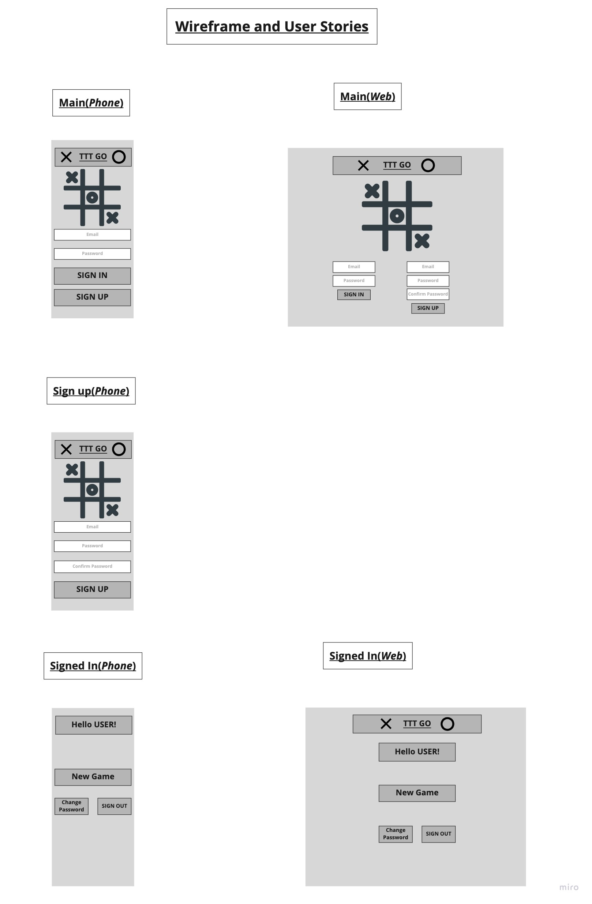
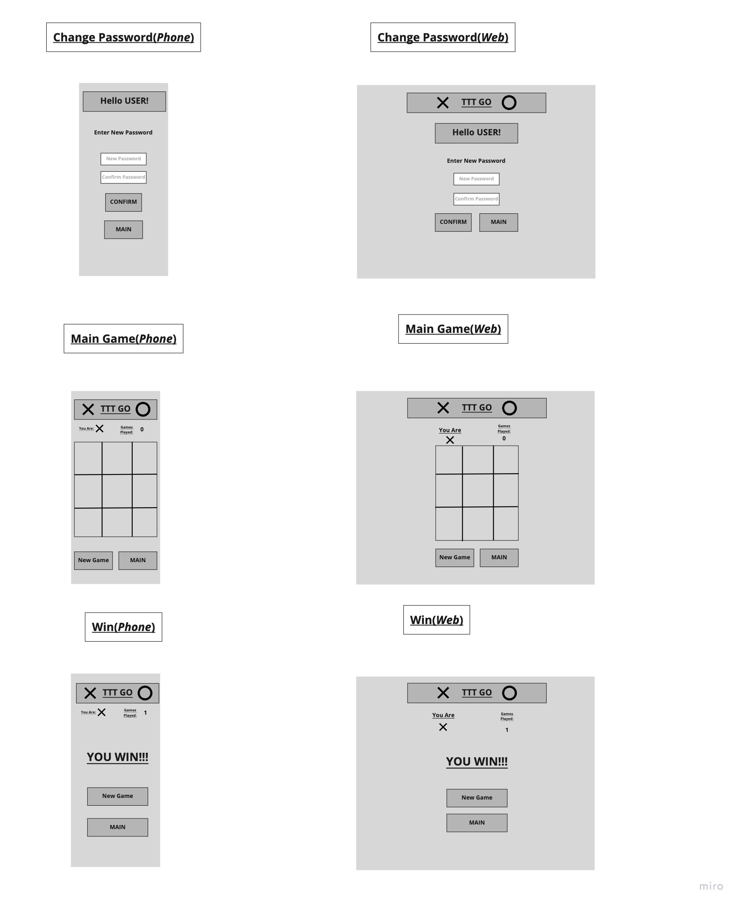
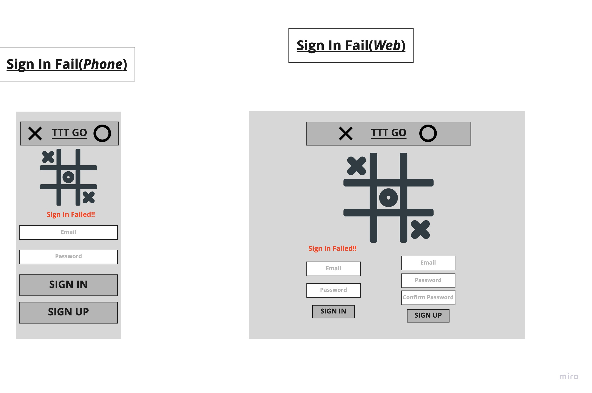

# TIC TAC TOE GO

A client-side multiplayer tic-tac-toe game wbe app. This is a project where I  
test my skills.

### Important Links

### Planning Story

### User Stories

- *As a New User*, I want to make an account so that I may sign in.
- *As a User*, I want to sign in so I may play.
- *As a User*, I want to be notified that my sign-in credentials failed, so that I  
may change my password, or try to sign in again.
-*As a User*, I want to change my password if I forget it/want to.
-*As a User*, I want to know which side(X/O) I am, so I may play.
-*As a User*, I want to be able to start a new game if I want.
-*As a User*, I want to know if I won or lost the current game so I know to start a new one.
-*As a User*, I want to know what spaces are available to me so that I may make a valid move.
-*As a Signed-In User*, I want to know how many games I've played, so that I may keep track.

### Technologies Used

- Javascript.
- JQuery
- HTML/CSS.
- Bootstrap.

### Unsolved Problems

### Images

#### Wireframes:

